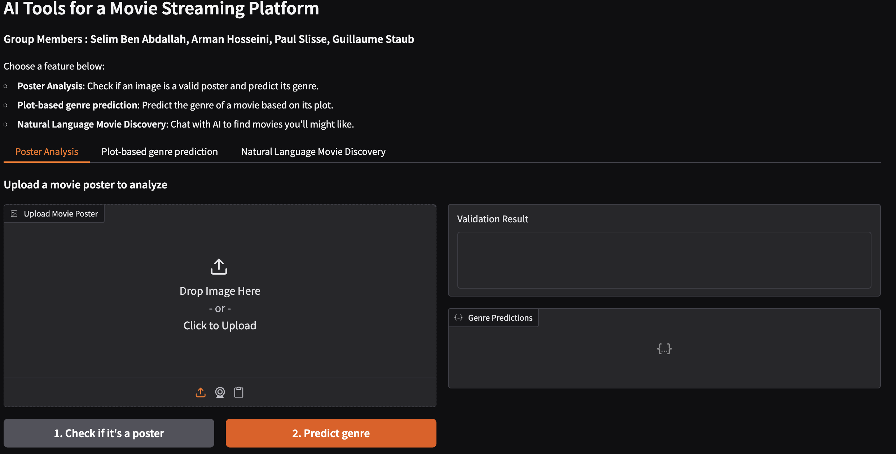
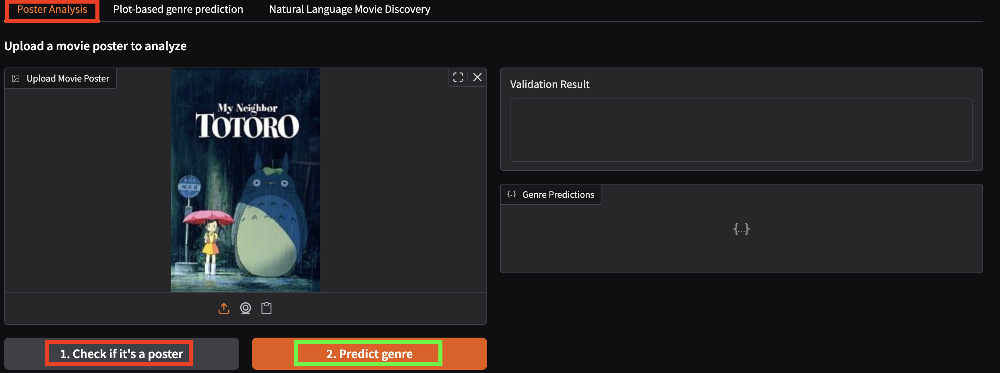
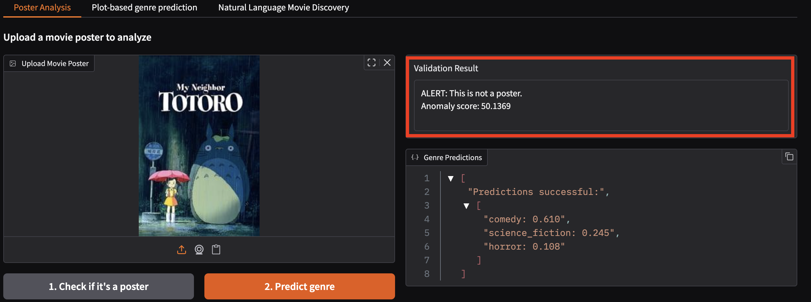
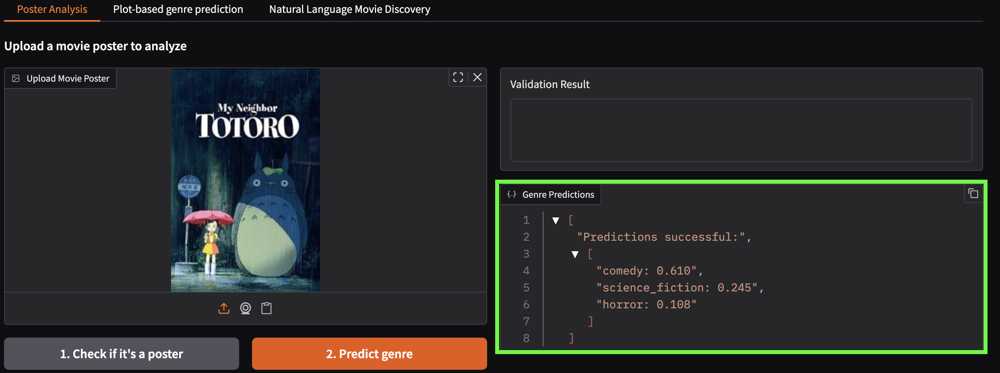
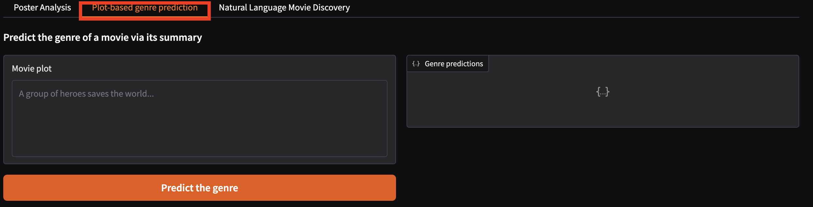
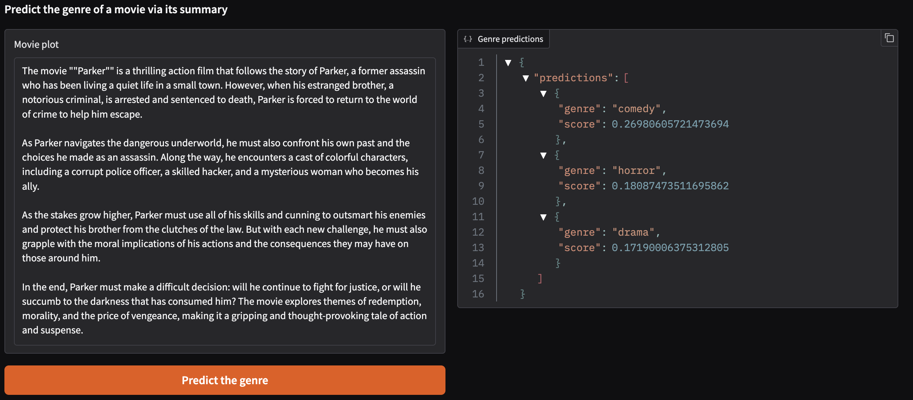
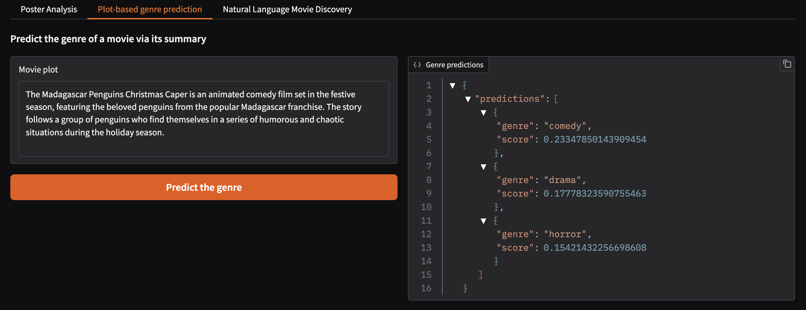
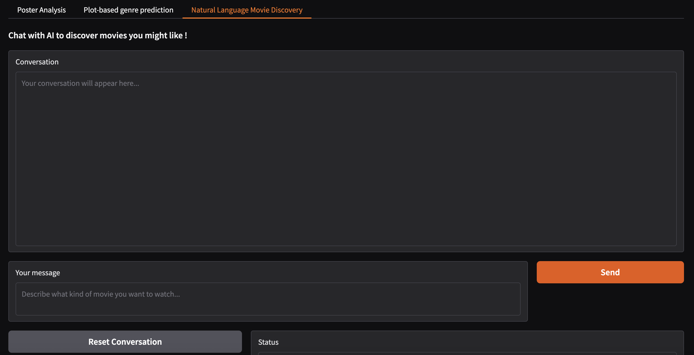
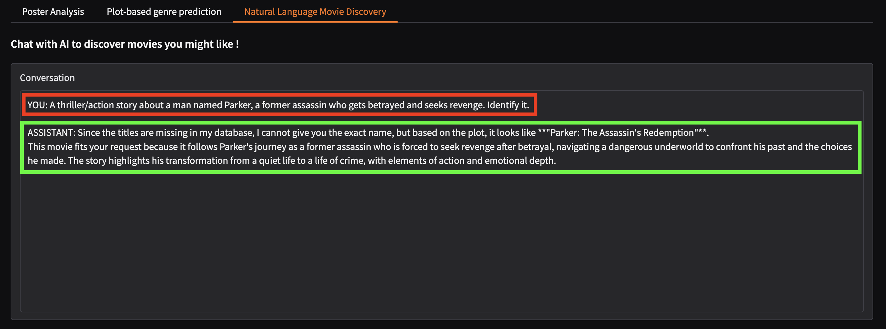

# AIF Project : AI Tools for a Movie Streaming Platform
INSA Toulouse : https://davidbert.github.io/AIF/project/project.html
Group Members : Selim Ben Abdallah, Arman Hosseini, Paul Slisse, Guillaume Staub

# Architecture

aif-project/
├── app/
│   ├── posters/                         # Part 1: genre prediction from posters (ResNet)
│   │   ├── model.py
│   │   ├── inference.py
│   │   └── genres.json                  # class names if not in /models
│   ├── validation/                      # Part 2: poster validation (OOD detection)
│   │   ├── feature_extractor.py
│   │   └── inference_ood.py
│   ├── nlp/                             # Part 3: genre prediction from plots (DistilBERT)
│   │   └── nlp_model.py
│   └── rag/                             # Part 4: natural-language movie discovery (RAG)
│       ├── embedding_model.py
│       ├── foundation_model.py
│       ├── rag_model.py
│       └── retriever_model.py
├── models/                              # (not committed, hosted on google drive)
│   ├── vision_weights.pth
│   ├── genres.json
│   ├── ood_detector.joblib
│   ├── part3_nlp_weights.pth
│   ├── part3_classes.json
│   ├── part3_plot.ann
│   ├── part4_rag_index.ann
│   ├── part4_rag_map.json
│   └── part4_rag_brochure.pkl
├── data/                                # datasets (not commited, hosted on google drive)
├── tutorial/
├── scripts/                             # training / indexing / debugging scripts
│   ├── build_brochure.py
│   ├── build_clip_annoy.py
│   ├── build_movies_json.py
│   ├── create_repositories_train_val.py
│   ├── debug_brochure.py
│   ├── movie-engine.py
│   ├── test_inference.py
│   ├── train_ood.py
│   └── train_posters_cnn.py
├── main.py                              # Flask API
├── gradio-app.py                        # Gradio UI
├── docker-compose.yml
├── Dockerfile-api
├── Dockerfile-gradio
├── requirements-api.txt
├── requirements-gradio.txt
└── README.md

# Tutorial
## 1. Main page

- The `Poster Analysis` tab is for the first and second parts of the project.
- The `Plot-based genre prediction` tab is for the third part of the project.
- The `Natural Language Movie Discovery` tab is for the fourth part of the project.

## 2. Part 1 & 2

- Click `Poster Analysis`, then upload a poster image in `Upload Movie Poster`.

## 3. Poster validation result

- Click 1 to check if it's a poster. Expected output in the right panel `Validation Result`.

## 4. Genre prediction result

- Click 2 to predict genre. Expected output in the right panel `Genre Predictions`.

## 5. Part 3

- Paste a movie summary into the `Movie plot text box`.
- Click `Predict the genre`.

## 6. Part 3 — prediction example 1

## 7. Part 3 — prediction example 2

## 8. Part 4

- Type what you want (mood, genre, similar movie, plot description) in `Your message`, then click `Send`.
- The assistant answers in the `Conversation box`.
- It may say something like: “titles are missing in my database” and guess a title based on retrieved plots.
- You can refine by asking follow-up questions (e.g., “make it funnier”, “more recent”, “no horror, etc.).
- Click `Reset Conversation` to clear the conversation history.

## 9. Part 4 — Q&A example

# Model Weights

Model weights are **NOT** stored in this repository.

They are hosted on Google Drive.

## Part 1 – Poster genre model

- File: `vision_weights.pth` (old version : `movie_genre_cpu.pt`)
- Used by API route : `POST /api/predict_poster_genre`
- Location: https://drive.google.com/drive/folders/16oitro8r5frXZE3N1jsFDzxZXDaghliw?usp=sharing

For local development:

1. Download `vision_weights.pth` from the link above.
2. Place it in this `models/` directory so the full path is:

   `models/vision_weights.pt`

## Part 2 – Detection of false poster model

- File: `ood_detector.joblib`
- Used by API route : `POST /api/check_is_poster`
- Location: https://drive.google.com/drive/folders/16oitro8r5frXZE3N1jsFDzxZXDaghliw?usp=sharing

For local development:

1. Download `ood_detector.joblib` from the link above.
2. Place it in this `models/` directory so the full path is:

   `models/ood_detector.joblib`

## Part 3 – Predicting genre from plots

- Files : `part3_nlp_weights.pth`, `part3_classes.json`, `part3_plot.ann`
- Old Files: `part3_movie_weights.pth`, `part3_movie_brochure.pkl`, `part3_movie_index.ann`
- Used by API route : `POST /api/predict_plot_genre`
- Location: https://drive.google.com/drive/folders/16oitro8r5frXZE3N1jsFDzxZXDaghliw?usp=sharing

For local development:

1. Download `part3_nlp_weights.pth`, `part3_classes.json`, `part3_plot.ann` from the link above.
2. Place it in this `models/` directory so the full path is:

   `models/part3_nlp_weights.pth`
   `models/part3_classes.json`
   `models/part3_plot.ann`

Description:

 - `part3_nlp_weights.pth` is the file containing the weights of the model (NLP model).
 - `part3_classes.json` is a json file
 - `part3_plot.ann` is the Annoy index, used to do the link between the query and the dataset.

## Part 4 – Natural language movie discovry 

- Files : `part4_rag_index.ann`, `part4_rag_map.json`, `part4_rag_brochure.pkl`
- Used by API routes : `POST /api/chat` and `POST /api/reset_chat`
- Location: https://drive.google.com/drive/folders/16oitro8r5frXZE3N1jsFDzxZXDaghliw?usp=sharing

For local development:
1. Download `part4_rag_brochure.pth`, `part4_rag_map.json`, `part4_rag_index.ann` from the link above.
2. Place it in this `models/` directory so the full path is:

    `models/part4_rag_brochure.pth`
    `models/part4_rag_map.json`
    `models/part4_rag_index.ann`